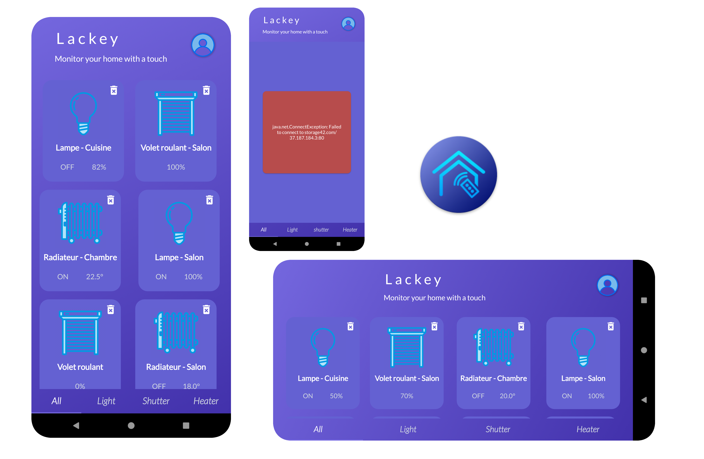
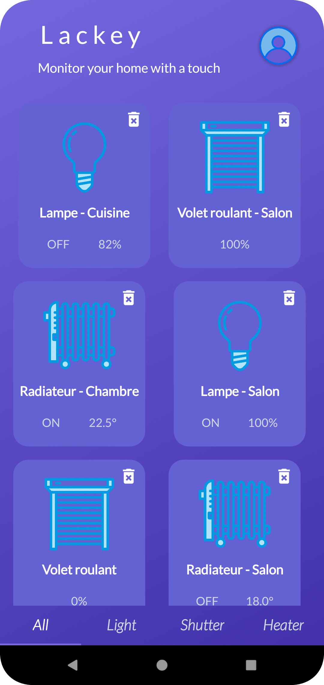
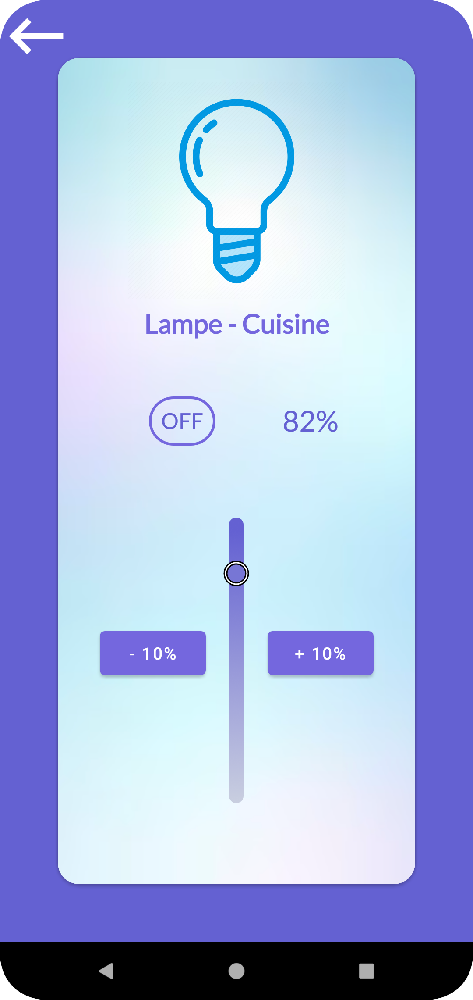
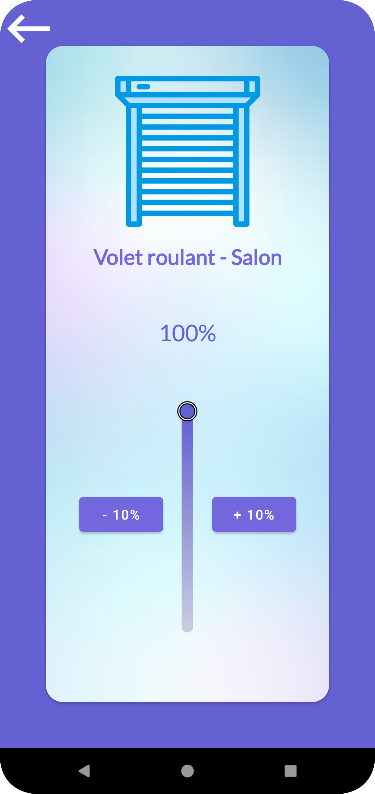
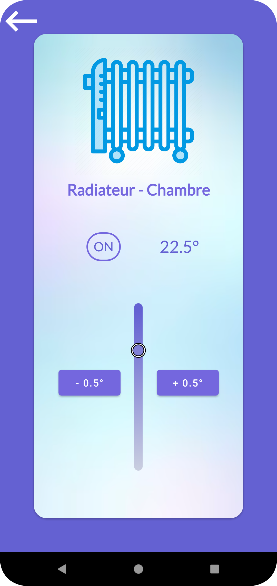
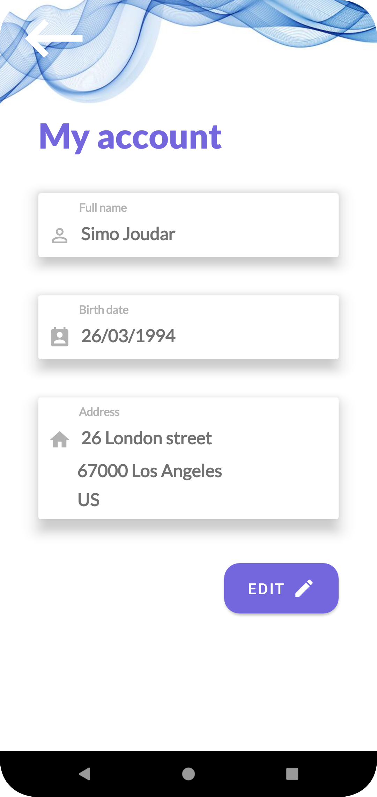
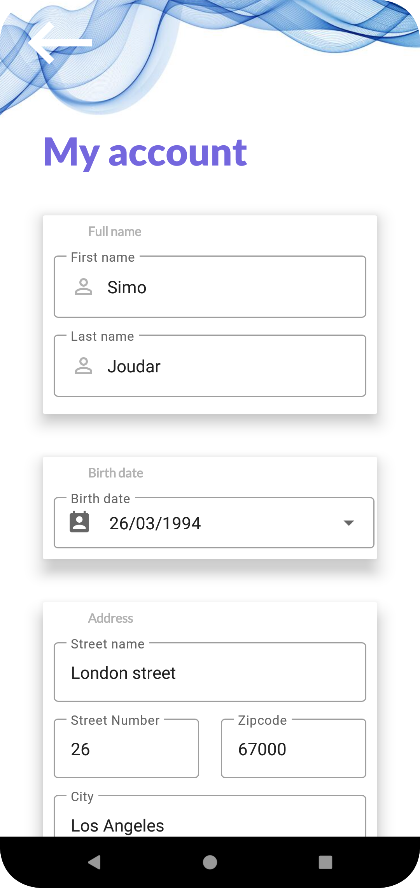

# Lackey

## About
This is an **Android evaluation project** requested by an employer to evaluate my Android development skills.

This is a domotics **Native Android App**, named **Lackey**, that I designed, architectured and developed for smart homes, to interact with connected home devices.

It **displays all available devices**, and allows to **access devices** to **monitor** them or **steer them remotely** from the app.

It connects to an API to fetch data about available devices but keeps no local persistence.

It also has a **profile** feature that shows account informations, with the possibility to edit them. These infos are persisted locally.

This app is available in English and French.

## Technicalities
This projet leverages “SOLID principles” by following Clean Architecture rules. It's fully written in Kotlin and uses the power of Coroutines StateFlow as state holders. All implemented through an MVVM architecture. 
This approach helps minimize code complexity by insuring a clean, testable, reusable and maintainable code.

This project is powered by Jetpack libraries. 
It implements Android’s Navigation Component (NavGraph, NavHost, NavController) to navigate throughout the different Fragments and to handle navigation animation and safe argument passing.
It uses a ViewPager to swipe between different display option.
It has a RecyclerView to display devices in a grid.
Dependency injection using Hilt insures the reusability, refactorability and testability of our code.
View binding and custom data binding is also used to easily communicate data across views, DataStore for persistence and Retrofit and Coroutines for API calls.

## Testing
This source code package incorporates **unit tests** and **instrumentation tests** as well as the **HTML results** of these tests.

## Installation
Clone/Download this repository and open it with **Android Studio**
```bash
git clone git@github.com:SimoJOUDAR/Lacky.git
```

## Run the App
Once the project opened, you can run the App using Android studio's AVD to execute it.

## Obfuscation
The source code has obfuscation and shrinkResources enabled. It uses an external obfuscation dictionary available at https://bit.ly/3uGrnSu

## Generating signed APK
From Android Studio:
1. Go to ***Build*** menu
2. Go to ***Build Bundle(s) / APK(s)***
3. Click on ***Build APK(s)*** The APK generated can be loaded and run on any Android phone.

## Preview video
https://user-images.githubusercontent.com/80898080/225471520-bc7ed16d-c07d-4180-b5f4-15ccc58088b6.mp4

## Preview on a smartphone



 -  - 

-

 -  - 


